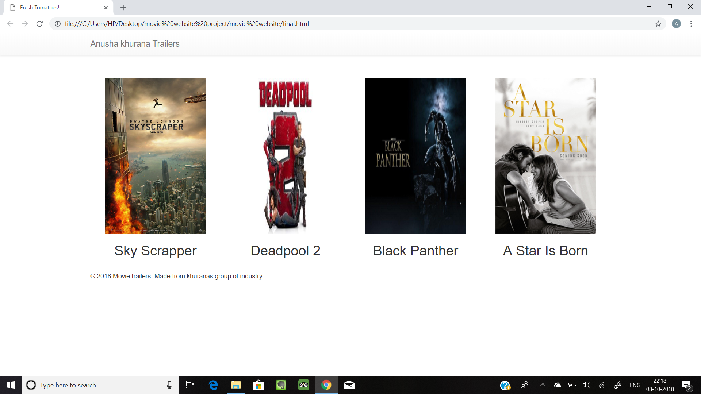

This project is concerned  to the learning of the python in , 
but depending on your background knowledge you do not need to complete the entire course .
This project will build a Movie Trailer Website where users can see my favorite movies
and watch the trailers. The code stores a list of movie titles, poster images, and movie trailer URLs. 
This information is displayed on a web page and allow users to review the movies and watch the trailers.
. Here's what you should do:

1. Download python from the python official website(https://www.python.org/).
2. Install Python IDLE 3.7.0;
3. Download the document to your desktop.
3. Open IDLE (a built-in python editor that comes with python installation).
4. Use IDLE to open the `entertainment.py` in the desktop.
.png "Open IDLE")
5. Run the module from the Run window, then click run module or press F5 on your keyboard.
6. Output should be the following in a browser window.

